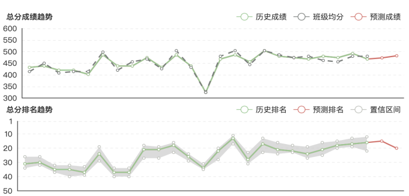
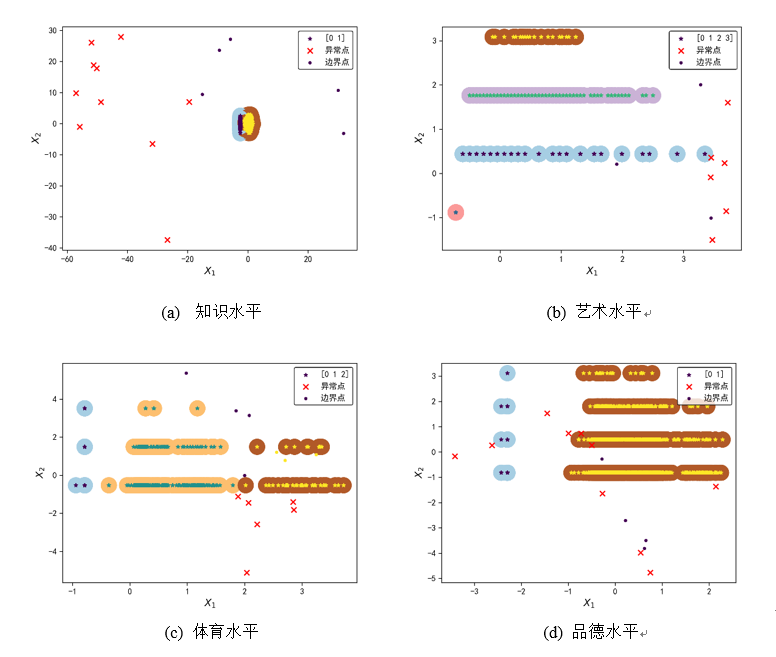

# EDM
Educational data mining, the main contents include the establishment of student portraits, 
student behavior analysis, behavior correlation analysis.
> 所用到的主要技术点
>
+ 采用ARIMA和ARMA进行时序成绩预测 \

+ 采用加权Minkowski距离+DBSCAN进行行为画像聚类 
  1. 可根据行为特征的重要程度对学生不同的行为特征加权处理，实现自适应聚类。
  2. 离散化标签建立学生行为画像。

+ 采用多频繁模式树FP-TREE的行为关联性分析
> 学生画像系统展示 
> 
to do...

> 参考资料
>
1. https://tianchi.aliyun.com/competition/entrance/231704/introduction 
